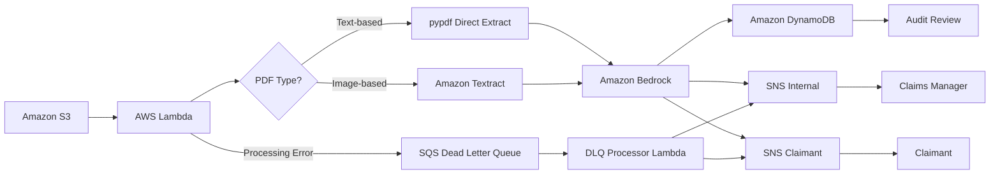

# AWS AI Document Intelligence Pipeline

> This is the second project in my AWS portfolio. While my
> [first project](https://github.com/nathanielkay11-tech/aws-three-tier-wordpress-stack)
> focused on provisioning and automating core infrastructure, this one layers
> Generative AI on top of a serverless event-driven pipeline — moving from
> "I can build infrastructure" to "I can make infrastructure intelligent."

## 🗺️ Project Navigation: The 3 Iterations

### 📍 Iteration 1: Design and Prompt Engineering
- **What it is:** The architecture design, business logic and prompt engineering phase. See the [`/prompts/`](prompts/) folder for versioned system prompts and [`/docs/design-decisions.md`](docs/design-decisions.md) for all architectural decision records.
- **The Goal:** To design a production-quality AI pipeline from first principles — defining the routing matrix, SLA logic, dual notification strategy and prompt constraints before writing a single line of code.

### 📍 Iteration 2: Infrastructure Build and Testing
- **What it is:** Full Terraform IaC deployment of all AWS services, Lambda function development and end-to-end testing across all four routing outcomes.
- **The Goal:** To prove the architecture works in a real AWS environment — all four routing outcomes tested and documented with evidence in [`/docs/testing-log.md`](docs/testing-log.md).

### 📍 Iteration 3: One-Shot Prompt Engineering
- **What it is:** A single, multi-constraint prompt capable of reproducing the complete Terraform infrastructure and Lambda function from scratch in one AI-assisted pass. See [`/prompts/iteration3-one-shot-prompt.md`](prompts/iteration3-one-shot-prompt.md).
- **The Goal:** To demonstrate prompt engineering maturity — treating the AI as a junior engineer and validating every output as the architect.
- **Status:** ✅ Prompt engineered, architect review complete and full redeployment validated — all four routing outcomes confirmed on reproduced pipeline

**Key insight:** The one-shot prompt was only possible because of the iterative build process that preceded it. Every constraint in the prompt reflects a real problem encountered and solved during development — from the pypdf sys.path insert to the inference profile ARN to the markdown fence stripping. Without the build experience, the prompt could not have been written. This demonstrates that effective AI prompt engineering requires deep domain knowledge, not just clever wording.

**Architect Review Findings (10 April 2026):**
The generated output was validated against the working build. Two discrepancies were identified and corrected:
1. Environment variable naming — `DYNAMODB_TABLE_NAME` vs `DYNAMODB_TABLE`
2. `depends_on` reference difference — valid alternative but differs from tested fix

Full redeployment test to follow as final validation step.

---

## 🏢 The Business Problem

Insurance companies receive thousands of claims documents daily. A large portion
of initial triage — reading the claim, extracting key data, and flagging high-risk
cases — is done manually. This is slow, expensive, and doesn't scale.

This project automates that triage layer. A document goes in. Structured, actionable
data comes out — without a human touching it unless the AI flags a risk or fails a
validation check.

---

## 💡 Why This Architecture — Design Decisions & Cost Analysis

### Architecture Alternatives Considered

Three approaches were evaluated before settling on the current design:

**Option 1: Always-on EC2 + RDS (Rejected)**
The traditional approach — a dedicated server running 24/7 to process incoming claims. Reliable and familiar, but fundamentally mismatched to this use case. Insurance claims arrive in bursts, not at a steady stream. An always-on server sits idle for the majority of its runtime, accumulating cost regardless of whether a single document is being processed. Maintenance overhead, patching and capacity planning add further operational cost that has no business justification here.

**Option 2: Containerised Pipeline on ECS/Fargate (Rejected)**
A more modern approach — containerised logic running on Fargate. Better than EC2 for variable workloads, but still carries a minimum billing floor and added complexity around container management, image versioning and task definitions. For a document triage pipeline with no real-time latency requirement, this overhead is unnecessary.

**Option 3: Fully Serverless Event-Driven Pipeline — Current Architecture ✅**
Lambda, DynamoDB, SNS and SQS are all pay-per-use with zero idle cost. The pipeline only runs when a document is uploaded. Bedrock as a managed service removes all AI infrastructure overhead — no GPU provisioning, no model training, no MLOps. Textract handles OCR natively without custom computer vision code. The entire stack scales automatically from 1 to 500,000 claims without a single configuration change.

---

### 📊 Projected Cost by Use Case Tier

#### Volume Definitions

| Tier | Monthly Claims | Daily Average | Profile |
|---|---|---|---|
| 🟢 **Small Insurer** | 1,000–5,000 | 33–167/day | Regional insurer, single product line, low automation maturity |
| 🟡 **Mid-Size Insurer** | 10,000–50,000 | 333–1,667/day | Multi-line insurer, active digital transformation programme |
| 🔴 **Large Enterprise** | 100,000–500,000 | 3,333–16,667/day | National insurer or multi-brand group, high-volume automated triage |

---

#### Monthly Cost Estimates

All figures based on current AWS us-east-1 pricing (April 2026). Assumes average claim document of 2 pages, ~2,000 input tokens and ~500 output tokens per Bedrock invocation, and 60% of claims requiring Textract (image-based PDFs).

| Service | Small (5,000/mo) | Mid (50,000/mo) | Large (500,000/mo) |
|---|---|---|---|
| Amazon Bedrock (Claude Sonnet 4.5) | ~$80 | ~$800 | ~$8,000 |
| Amazon Textract (60% image-based) | ~$45 | ~$450 | ~$4,500 |
| AWS Lambda | ~$1 | ~$5 | ~$50 |
| Amazon DynamoDB | ~$1 | ~$5 | ~$25 |
| Amazon SNS + SQS | <$1 | ~$2 | ~$10 |
| Amazon S3 | <$1 | ~$2 | ~$15 |
| CloudWatch Logs | ~$1 | ~$5 | ~$40 |
| **Total Monthly** | **~$130** | **~$1,270** | **~$12,640** |
| **Cost per claim** | **~$0.026** | **~$0.025** | **~$0.025** |

> ⚠️ These are indicative estimates. Bedrock token usage will vary based on document length and complexity. Always validate with the [AWS Pricing Calculator](https://calculator.aws/pricing/2/home) for production budgeting.

**The key insight:** Bedrock accounts for approximately 60% of total pipeline cost and Textract for a further 35%. The remaining infrastructure — Lambda, DynamoDB, SNS, S3 — costs almost nothing. This is the correct trade-off: the value-generating steps dominate the bill, not the plumbing.

---

#### Cost vs. Manual Processing Benchmark

To contextualise these numbers — a human claims processor typically handles 15–25 documents per hour at a fully-loaded cost of $35–50/hour. At 20 documents/hour and $40/hour fully-loaded:

| Volume | Manual Processing Cost | Pipeline Cost | Saving |
|---|---|---|---|
| 5,000 claims/month | ~$10,000 | ~$130 | **98.7%** |
| 50,000 claims/month | ~$100,000 | ~$1,270 | **98.7%** |
| 500,000 claims/month | ~$1,000,000 | ~$12,640 | **98.7%** |

The pipeline doesn't replace human judgement — high-risk claims still route to a human reviewer. It eliminates the manual triage layer entirely, freeing claims staff to focus on complex cases that genuinely require human expertise.

---

## 🏗️ Architecture Overview

---

## 🚀 Project Status

🟢 Build, testing, demo and Iteration 3 redeployment complete

---

## 🎬 Demo Video

Watch the pipeline process four real claim documents live — from upload to AI analysis, routing decisions, email notifications and DynamoDB storage across all four routing outcomes.

[▶ Watch on YouTube](https://youtu.be/TYg1RSfvLNQ)

---

## ✅ Testing Results

All test cases documented with evidence in [docs/testing-log.md](docs/testing-log.md)

| Test | Document | PDF Type | Extraction Method | Risk Flag | Recommended Action | Result |
|---|---|---|---|---|---|---|
| Test 1 | James Harrington — $60,520 property damage | Text-based | pypdf — Textract bypassed | ✅ Triggered — amount exceeds $50,000 threshold, prior claim detected | Human review — HIGH priority | ✅ Pass |
| Test 2 | Patricia Collins — $7,550 burst pipe | Image-based | Textract OCR | ❌ Not triggered | Pending documentation — missing contractor estimate | ✅ Pass |
| Test 3 | Marcus Webb — $950 fence repair | Image-based | Textract OCR | ❌ Not triggered | Auto-process — clean low value claim | ✅ Pass |
| Test 4 | Invalid file — fake PDF | N/A | N/A — pipeline failure | N/A | Processing error — dual SNS via DLQ processor | ✅ Pass |
---

## ⚠️ Known Limitations

- **Claimant authentication** — direct S3 upload assumes a secure
upload mechanism exists. A full authentication layer using AWS Cognito
and pre-signed S3 URLs is out of scope for this version and documented
as a Phase 2 enhancement (see [ADR-005](docs/design-decisions.md)).

- **Handwritten documents** — fully handwritten claim forms are not
supported in this version. The pipeline handles typed digital PDFs
and scanned printed forms. Full handwriting detection is documented
as a Phase 2 enhancement (see [ADR-009](docs/design-decisions.md)).

- **Auto-process audit reporting** — auto-processed claims are
flagged in DynamoDB via audit_flag but no automated daily digest
report is generated in this version. A daily HTML audit report
with S3 link delivery is documented as a Phase 2 enhancement
(see [ADR-010](docs/design-decisions.md)).

- **SLA reminder notifications** — SLA deadline is calculated and
included in email alerts but no automated follow-up reminder is
sent if a claim remains unresolved. Automated reminders via
EventBridge Scheduler are documented as a Phase 2 enhancement
(see [ADR-010](docs/design-decisions.md)).

---

## 🤖 Development Approach

This project was developed using an AI-assisted workflow. Claude
(Anthropic) was used as a technical sounding board throughout the
build — helping with code structure, troubleshooting, and
documentation. All architectural decisions, business logic,
security considerations and project direction were driven by me.

This reflects how modern cloud engineers actually work in 2026 —
knowing how to leverage AI tools effectively is itself a
professional skill.