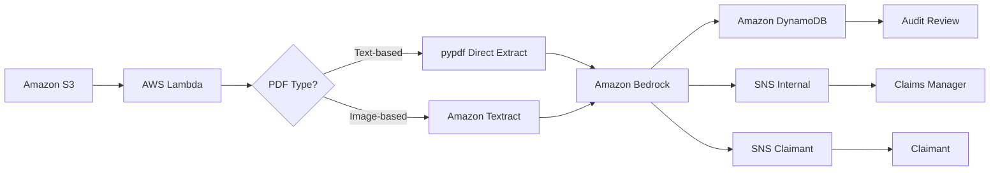

# AWS AI Document Intelligence Pipeline

> This is the second project in my AWS portfolio. While my
> [first project](https://github.com/nathanielkay11-tech/aws-three-tier-wordpress-stack)
> focused on provisioning and automating core infrastructure, this one layers
> Generative AI on top of a serverless event-driven pipeline — moving from
> "I can build infrastructure" to "I can make infrastructure intelligent."

## 🗺️ Project Navigation: The 3 Iterations

### 📍 Iteration 1: Design and Prompt Engineering
- **What it is:** The architecture design, business logic and prompt engineering phase. See the [`/prompts/`](prompts/) folder for versioned system prompts and [`/docs/design-decisions.md`](docs/design-decisions.md) for all architectural decision records.
- **The Goal:** To design a production-quality AI pipeline from first principles — defining the routing matrix, SLA logic, dual notification strategy and prompt constraints before writing a single line of code.

### 📍 Iteration 2: Infrastructure Build and Testing
- **What it is:** Full Terraform IaC deployment of all AWS services, Lambda function development and end-to-end testing across all four routing outcomes.
- **The Goal:** To prove the architecture works in a real AWS environment — all four routing outcomes tested and documented with evidence in [`/docs/testing-log.md`](docs/testing-log.md).

### 📍 Iteration 3: One-Shot Prompt Engineering
- **What it is:** A single, multi-constraint prompt capable of reproducing this entire repository from scratch in one AI-assisted pass.
- **The Goal:** To demonstrate prompt engineering maturity — treating the AI as a junior engineer and validating every output as the architect.

---

## 🏢 The Business Problem

Insurance companies receive thousands of claims documents daily. A large portion
of initial triage — reading the claim, extracting key data, and flagging high-risk
cases — is done manually. This is slow, expensive, and doesn't scale.

This project automates that triage layer. A document goes in. Structured, actionable
data comes out — without a human touching it unless the AI flags a risk or fails a
validation check.

---

## 🏗️ Architecture Overview

---

## 🚀 Project Status
🟡 Build and testing complete — Iteration 3 in progress

---

## ✅ Testing Results

All test cases documented with evidence in [docs/testing-log.md](docs/testing-log.md)

| Test | Document Type | Extraction Method | Risk Flag | Recommended Action | Result |
|---|---|---|---|---|---|
| Test 1 | Text-based PDF | pypdf — Textract bypassed | ✅ Triggered — amount $60,520 exceeds $50,000 threshold | Human review — HIGH priority | ✅ Pass |
| Test 2 | Image-based PDF | Textract OCR | ✅ Triggered — amount $60,520 exceeds $50,000 threshold | Human review — HIGH priority | ✅ Pass |
| Test 3 | Image-based PDF — missing docs | Textract OCR | ❌ Not triggered | Pending documentation | ✅ Pass |
| Test 4 | Image-based PDF — clean low value | Textract OCR | ❌ Not triggered | Auto-process | ✅ Pass |

---

## 🛠️ Services Used

| Service | Role |
|---|---|
| Amazon S3 | The inbox — where claims are uploaded and the pipeline starts |
| AWS Lambda | The coordinator — connects all services and runs only when needed |
| Amazon Textract | Converts the PDF into readable text the computer can analyze |
| Amazon Bedrock | Managed AI that analyzes the text and returns structured output based on the prompt |
| Amazon DynamoDB | Stores all claim results as structured JSON — auto-processed claims with medium confidence are flagged for periodic batch review without triggering an alert |
| Amazon SNS | Dual notification layer — SNS-Internal alerts the claims team for human review, fraud flags, processing errors and missed SLAs. SNS-Claimant notifies the claimant directly when documentation is missing or resubmission is required |
| pypdf | Extracts text directly from text-based PDFs — bypasses Textract for digitally created documents, reducing cost and latency |

---

## ⚠️ Known Limitations

- **Claimant authentication** — direct S3 upload assumes a secure
upload mechanism exists. A full authentication layer using AWS Cognito
and pre-signed S3 URLs is out of scope for this version and documented
as a Phase 2 enhancement (see [ADR-005](docs/design-decisions.md)).

- **Handwritten documents** — fully handwritten claim forms are not
supported in this version. The pipeline handles typed digital PDFs
and scanned printed forms. Full handwriting detection is documented
as a Phase 2 enhancement (see [ADR-009](docs/design-decisions.md)).

- **Auto-process audit reporting** — auto-processed claims are
flagged in DynamoDB via audit_flag but no automated daily digest
report is generated in this version. A daily HTML audit report
with S3 link delivery is documented as a Phase 2 enhancement
(see [ADR-010](docs/design-decisions.md)).

- **SLA reminder notifications** — SLA deadline is calculated and
included in email alerts but no automated follow-up reminder is
sent if a claim remains unresolved. Automated reminders via
EventBridge Scheduler are documented as a Phase 2 enhancement
(see [ADR-010](docs/design-decisions.md)).

---

## 🤖 Development Approach

This project was developed using an AI-assisted workflow. Claude
(Anthropic) was used as a technical sounding board throughout the
build — helping with code structure, troubleshooting, and
documentation. All architectural decisions, business logic,
security considerations and project direction were driven by me.

This reflects how modern cloud engineers actually work in 2026 —
knowing how to leverage AI tools effectively is itself a
professional skill.