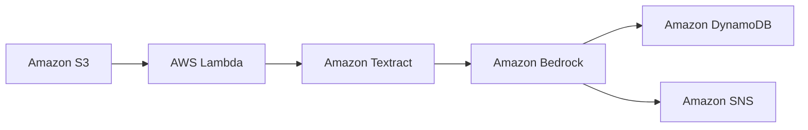

# AWS AI Document Intelligence Pipeline

> 🚧 **Work in Progress** — actively being built. Check back for updates.

> This is the second project in my AWS portfolio. While my
> [first project](https://github.com/nathanielkay11-tech/aws-three-tier-wordpress-stack)
> focused on provisioning and automating core infrastructure, this one layers
> Generative AI on top of a serverless event-driven pipeline — moving from
> "I can build infrastructure" to "I can make infrastructure intelligent."

## The Business Problem

Insurance companies receive thousands of claims documents daily. A large portion
of initial triage — reading the claim, extracting key data, and flagging high-risk
cases — is done manually. This is slow, expensive, and doesn't scale.

This project automates that triage layer. A document goes in. Structured, actionable
data comes out — without a human touching it unless the AI flags a risk or fails a
validation check.

## Architecture Overview
*Diagram coming — currently in design phase*

## Project Status
🔵 Design phase in progress

## Services Used

| Service | Role |
|---|---|
| Amazon S3 | The inbox — where claims are uploaded and the pipeline starts |
| AWS Lambda | The coordinator — connects all services and runs only when needed |
| Amazon Textract | Converts the PDF into readable text the computer can analyze |
| Amazon Bedrock | Managed AI that analyzes the text and returns structured output based on the prompt |
| Amazon DynamoDB | Stores the multi-structured JSON output — more flexible than a relational database like RDS |
| Amazon SNS | Flags high-risk claims to a human for manual review |

## Architecture

