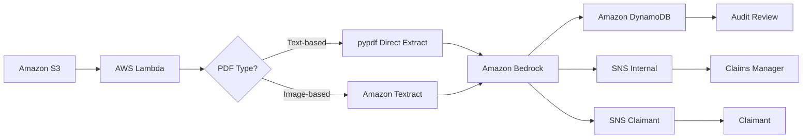

# AWS AI Document Intelligence Pipeline

> 🚧 **Work in Progress** — actively being built. Check back for updates.

> This is the second project in my AWS portfolio. While my
> [first project](https://github.com/nathanielkay11-tech/aws-three-tier-wordpress-stack)
> focused on provisioning and automating core infrastructure, this one layers
> Generative AI on top of a serverless event-driven pipeline — moving from
> "I can build infrastructure" to "I can make infrastructure intelligent."

## The Business Problem

Insurance companies receive thousands of claims documents daily. A large portion
of initial triage — reading the claim, extracting key data, and flagging high-risk
cases — is done manually. This is slow, expensive, and doesn't scale.

This project automates that triage layer. A document goes in. Structured, actionable
data comes out — without a human touching it unless the AI flags a risk or fails a
validation check.

## Architecture Overview

## Project Status

🟢 Infrastructure deployed — moving to testing phase

## Services Used

| Service | Role |
|---|---|
| Amazon S3 | The inbox — where claims are uploaded and the pipeline starts |
| AWS Lambda | The coordinator — connects all services and runs only when needed |
| Amazon Textract | Converts the PDF into readable text the computer can analyze |
| Amazon Bedrock | Managed AI that analyzes the text and returns structured output based on the prompt |
| Amazon DynamoDB | Stores all claim results as structured JSON — auto-processed claims with medium confidence are flagged for periodic batch review without triggering an alert |
| Amazon SNS | Dual notification layer — SNS-Internal alerts the claims team for human review, fraud flags, processing errors and missed SLAs. SNS-Claimant notifies the claimant directly when documentation is missing or resubmission is required |
| pypdf | Extracts text directly from text-based PDFs — bypasses Textract for digitally created documents, reducing cost and latency |

## Known Limitations

- **Claimant authentication** — direct S3 upload assumes a secure 
upload mechanism exists. A full authentication layer using AWS Cognito 
and pre-signed S3 URLs is out of scope for this version and documented 
as a Phase 2 enhancement (see ADR-005).

- **Handwritten documents** — fully handwritten claim forms are not 
supported in this version. The pipeline handles typed digital PDFs 
and scanned printed forms. Full handwriting detection is documented 
as a Phase 2 enhancement (see ADR-009).
