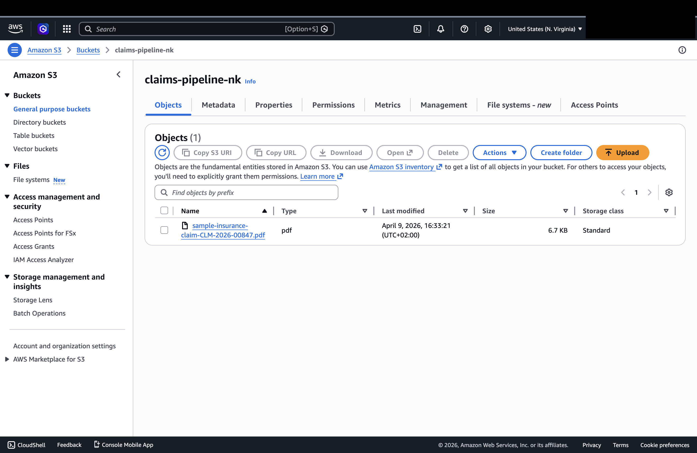
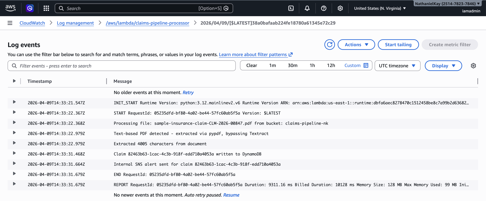
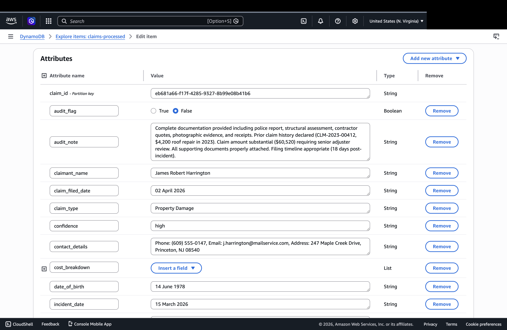
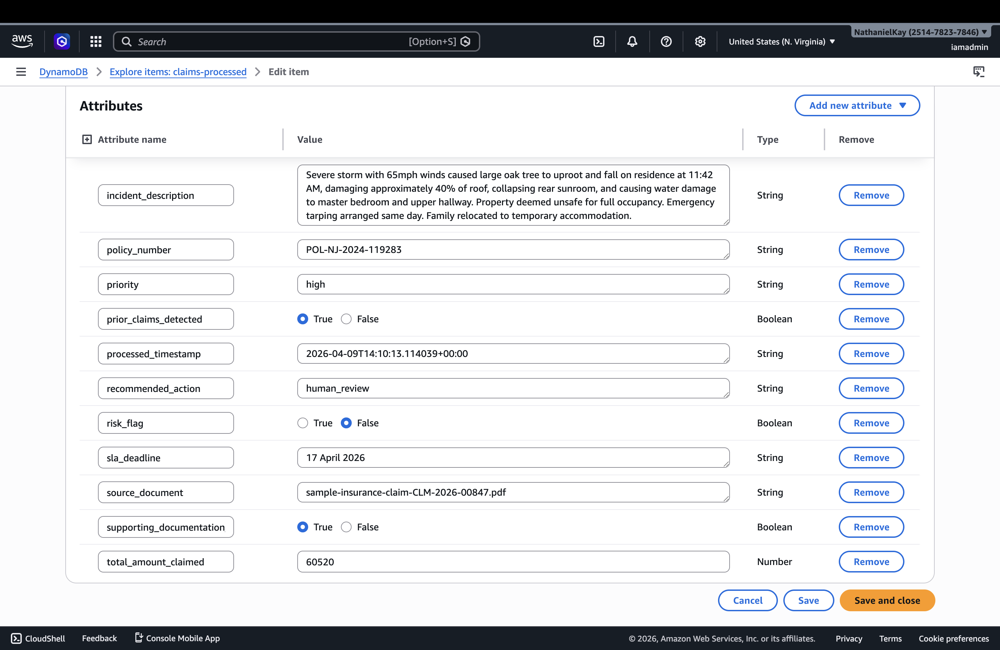
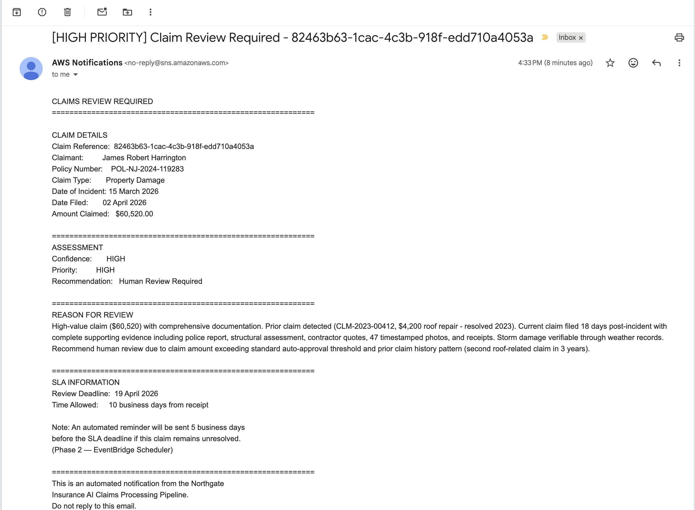
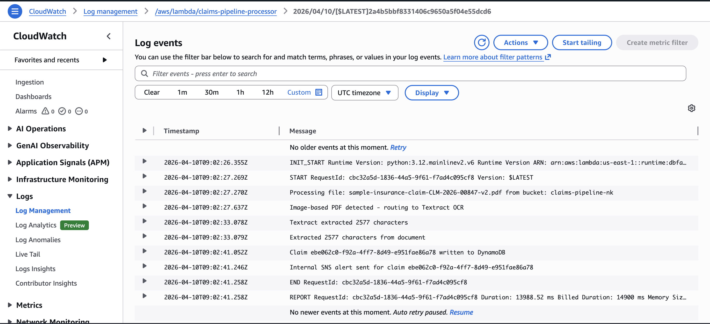

# Testing Log

This document records all test cases run against the AWS AI Document 
Intelligence Pipeline, including evidence screenshots and observations.

---

## Test 1 — Text-based PDF (09 April 2026)

**Document:** Sample insurance claim — Northgate Insurance Group  
**Claimant:** James Robert Harrington  
**Amount:** $60,520.00  
**PDF Type:** Text-based — extracted via pypdf, Textract bypassed  
**Result:** ✅ Pass — pipeline processed successfully end to end  

---

**Stage 1 — S3 Upload Trigger**

Claim PDF uploaded to `claims-pipeline-nk` S3 bucket,
automatically triggering the Lambda pipeline.

---

**Stage 2 — PDF Type Detection and Text Extraction**

Text-based PDF detected automatically. 4,005 characters extracted
directly via pypdf — Textract bypassed entirely, reducing cost and latency.

---

**Stage 3 — Bedrock AI Analysis**

Claude Sonnet 4.5 analyzed the extracted text and returned a high
confidence structured JSON output. Risk flag triggered correctly —
amount of $60,520 exceeds the $50,000 threshold. Prior claim
history detected.

---

**Stage 4 — Schema Validation**

All required fields present and validated before DynamoDB write.
Float values converted to Decimal for DynamoDB compatibility.

---

**Stage 5 — DynamoDB Storage**

Claim record written successfully with all extracted fields,
risk flags, confidence scores and SLA deadline.

---

**Stage 6 — SNS Alert Delivered**

Claim routed to human review at HIGH priority. Professional email
delivered with full structured assessment and SLA deadline of
19 April 2026.

---

**Bedrock Assessment:**  
High-value claim with comprehensive documentation. Prior claim
history disclosed (CLM-2023-00412, $4,200 roof repair 2023).
Filed 18 days post-incident — reasonable given complexity.
No fraud indicators detected. Human review required for
approval authority.

---

## Test 2 — Image-based PDF via Textract (10 April 2026)

**Document:** Sample insurance claim — Northgate Insurance Group  
**Claimant:** James Robert Harrington  
**Amount:** $60,520.00  
**PDF Type:** Image-based — routed through Textract OCR  
**Result:** ✅ Pass — pipeline processed successfully end to end  

---

**Stage 2 — Textract OCR**

Image-based PDF detected automatically. Document routed to 
Amazon Textract for OCR processing. Text extracted successfully
and passed to Bedrock for analysis.

---

**Stage 5 — DynamoDB Storage**

Claim record written successfully with all fields extracted
via Textract OCR.

---

**Stage 6 — SNS Alert Delivered**

Claim routed to human review at HIGH priority. SLA deadline
of 20 April 2026 correctly calculated.

![SNS email alert](../architecture/test