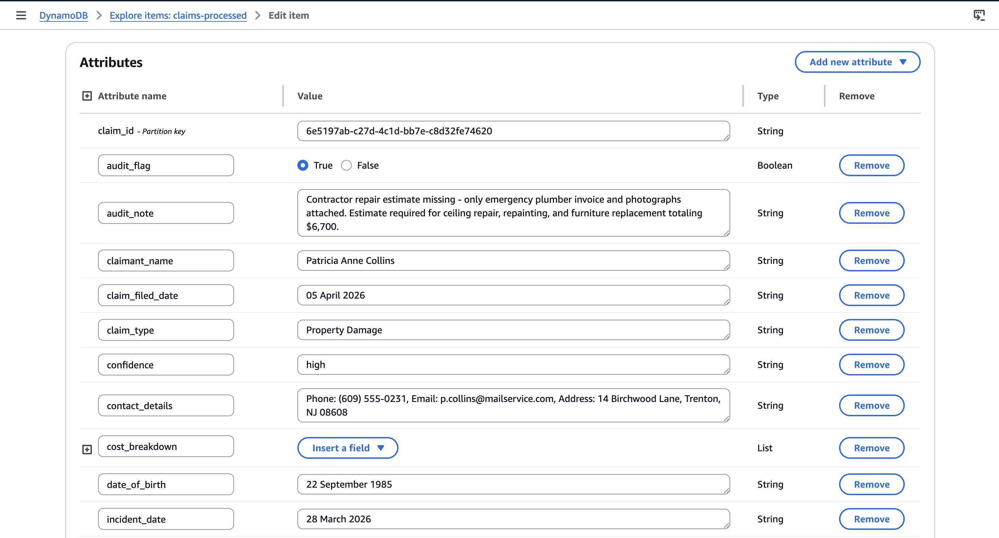
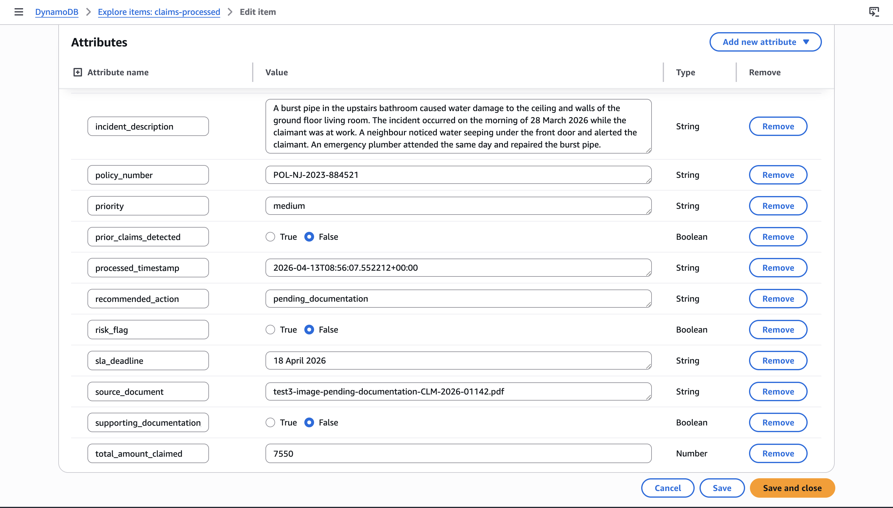
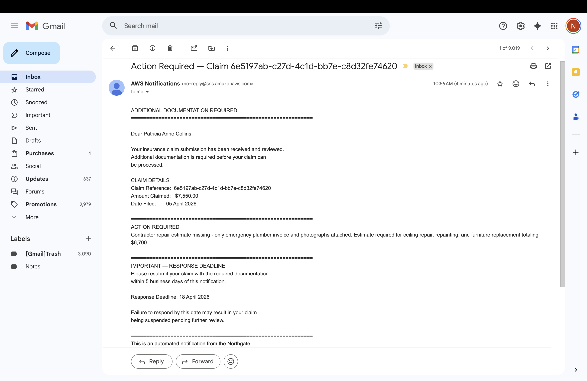
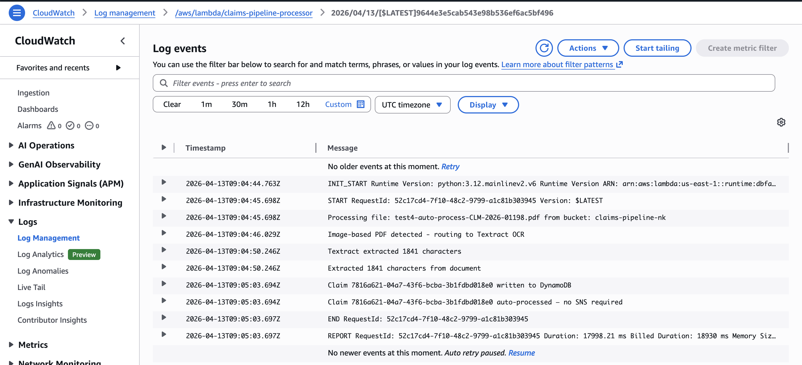
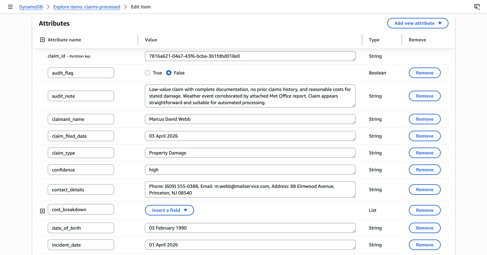
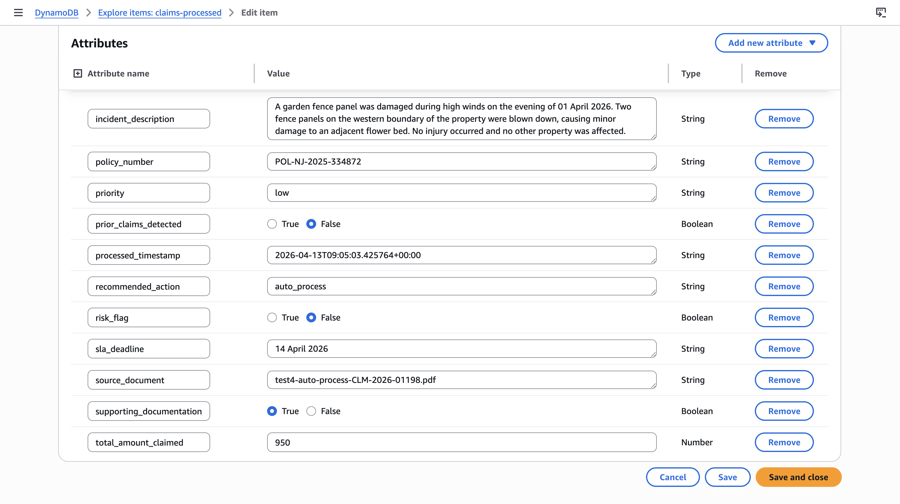
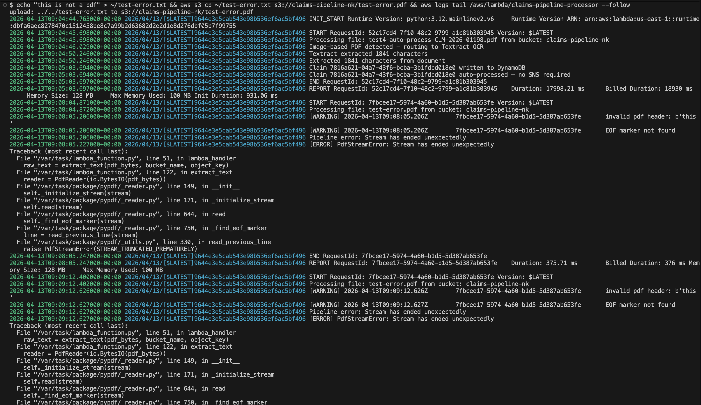
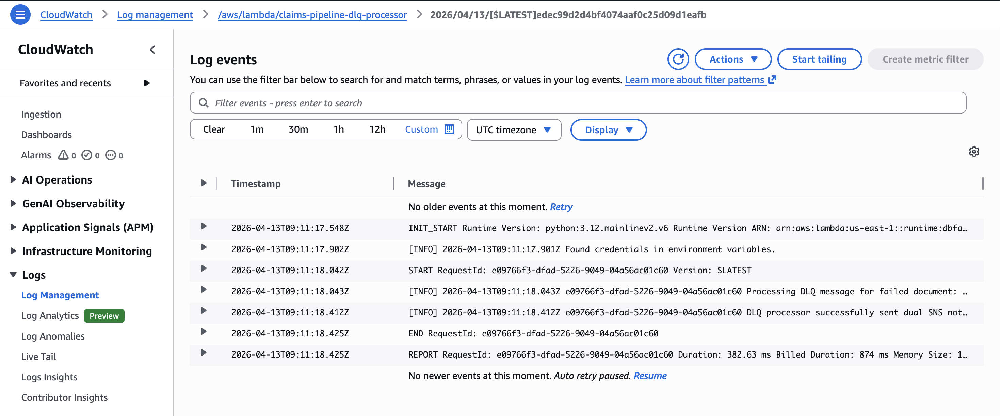
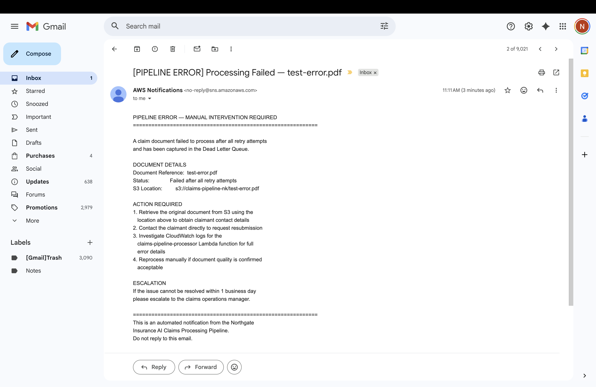
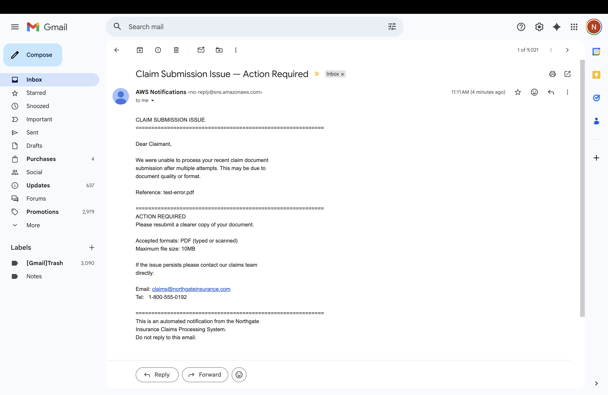

# Testing Log

This document records all test cases run against the AWS AI Document 
Intelligence Pipeline, including evidence screenshots and observations.

---

## Test 1 — Text-based PDF — Human Review HIGH (09 April 2026)

**Document:** Property damage claim — Northgate Insurance Group  
**Claimant:** James Robert Harrington  
**Amount:** $60,520.00  
**PDF Type:** Text-based — extracted via pypdf, Textract bypassed  
**Result:** ✅ Pass — human_review HIGH priority triggered correctly  

---

**Stage 1 — S3 Upload Trigger**

Claim PDF uploaded to `claims-pipeline-nk` S3 bucket,
automatically triggering the Lambda pipeline.

---

**Stage 2 — PDF Type Detection and Text Extraction**

Text-based PDF detected automatically. 4,005 characters extracted
directly via pypdf — Textract bypassed entirely, reducing cost and latency.

---

**Stage 3 — Bedrock AI Analysis**

Claude Sonnet 4.5 analyzed the extracted text and returned a high
confidence structured JSON output. Risk flag triggered correctly —
amount of $60,520 exceeds the $50,000 threshold. Prior claim
history detected (CLM-2023-00412, $4,200 roof repair 2023).

---

**Stage 4 — Schema Validation**

All required fields present and validated before DynamoDB write.
Float values converted to Decimal for DynamoDB compatibility.

---

**Stage 5 — DynamoDB Storage**

Claim record written successfully with all extracted fields,
risk flags, confidence scores and SLA deadline.

---

**Stage 6 — SNS Internal Alert Delivered**

Claim routed to human review at HIGH priority. Professional email
delivered to internal claims team with full structured assessment
and SLA deadline of 19 April 2026.

---

**Bedrock Assessment:**  
High-value claim with comprehensive documentation. Prior claim
history disclosed (CLM-2023-00412, $4,200 roof repair 2023).
Filed 18 days post-incident — reasonable given complexity.
No fraud indicators detected. Human review required for
approval authority.

**Observations:**
- Text-based PDF correctly detected — Textract bypassed entirely
- Risk flag triggered correctly on amount threshold and prior claim
- HIGH priority correctly assigned
- SNS-Internal fired — SNS-Claimant not triggered
- SLA deadline correctly calculated as 10 business days

---

## Test 2 — Image-based PDF — Pending Documentation (13 April 2026)

**Document:** Burst pipe property damage claim — Northgate Insurance Group  
**Claimant:** Patricia Anne Collins  
**Amount:** $7,550.00  
**PDF Type:** Image-based — routed through Textract OCR  
**Result:** ✅ Pass — pending_documentation routing triggered correctly  

---

**Stage 1 — S3 Upload Trigger**

Image-based claim PDF uploaded to `claims-pipeline-nk` S3 bucket,
automatically triggering the Lambda pipeline.

---

**Stage 2 — PDF Type Detection and Textract OCR**

Image-based PDF detected automatically. Document routed to 
Amazon Textract for OCR processing. 1,706 characters extracted
successfully and passed to Bedrock for analysis.

---

**Stage 3 — Bedrock AI Analysis**

Bedrock correctly identified that the contractor repair estimate
field was left blank by the claimant. Amount of $7,550 is below
the $50,000 threshold — no risk flag triggered. Missing
documentation identified as the sole reason for non-processing.

---

**Stage 4 — Schema Validation**

All required fields present and validated successfully.

---

**Stage 5 — DynamoDB Storage**

Claim record written with recommended_action set to
pending_documentation.

---

**Stage 6 — SNS Claimant Notification Delivered**

Correctly routed to SNS-Claimant — not SNS-Internal. Claimant
notified directly with specific action required and 5 business
day response deadline.

---

**Observations:**
- Image-based PDF correctly detected — routed through Textract OCR
- pending_documentation routing triggered correctly
- SNS-Claimant fired — SNS-Internal not triggered — correct behaviour
- Bedrock identified the specific missing document accurately
- No internal alert sent — correct as no fraud or risk flag present
- 5 business day SLA deadline correctly calculated

---

## Test 3 — Image-based PDF — Auto-Process (13 April 2026)

**Document:** Minor fence repair claim — Northgate Insurance Group  
**Claimant:** Marcus David Webb  
**Amount:** $950.00  
**PDF Type:** Image-based — routed through Textract OCR  
**Result:** ✅ Pass — auto_process routing triggered correctly  

---

**Stage 1 — S3 Upload Trigger**

Image-based claim PDF uploaded to `claims-pipeline-nk` S3 bucket,
automatically triggering the Lambda pipeline.

---

**Stage 2 — PDF Type Detection and Textract OCR**

Image-based PDF detected automatically. 1,841 characters extracted
via Textract OCR and passed to Bedrock for analysis.

---

**Stage 3 — Bedrock AI Analysis**

Bedrock correctly assessed the claim as low risk — amount of
$950 well below the $50,000 threshold, all documentation
present including contractor estimate and weather report,
no prior claims detected, filed 2 days post-incident.
High confidence returned.

---

**Stage 4 — Schema Validation**

All required fields present and validated successfully.

---

**Stage 5 — DynamoDB Storage**

Claim record written with recommended_action set to auto_process.
audit_flag set for periodic batch review.

---

**Stage 6 — No SNS Required**

Claim auto-processed directly to DynamoDB. No SNS notification
fired — correct behaviour for clean low-value claims with all
documentation present.

---

**Observations:**
- Image-based PDF correctly detected — routed through Textract OCR
- auto_process routing triggered correctly for clean low value claim
- No SNS alert fired — correct behaviour
- Bedrock correctly assessed all documentation as present
- No prior claims detected
- Pipeline processed claim end to end in under 20 seconds
- audit_flag written to DynamoDB for periodic batch review

---

## Test 4 — Processing Error — DLQ Processor (13 April 2026)

**Document:** Invalid file — plain text file submitted as PDF  
**Claimant:** N/A — document could not be processed  
**Amount:** N/A  
**PDF Type:** N/A — not a valid PDF  
**Result:** ✅ Pass — processing_error routing triggered correctly via DLQ processor  

---

**Stage 1 — S3 Upload Trigger**

Invalid file uploaded to `claims-pipeline-nk` S3 bucket as
`test-error.pdf`, automatically triggering the Lambda pipeline.

---

**Stage 2 — Pipeline Failure**

Lambda attempted to parse the file using pypdf. Invalid PDF
header detected. Pipeline raised PdfStreamError and threw
exception. No SNS notification fired from main Lambda —
correct behaviour. Exception raised and captured by S3
retry mechanism.

---

**Stage 3 — Dead Letter Queue Capture**

After all Lambda retry attempts were exhausted, the failed
S3 event was captured by the SQS Dead Letter Queue. The
DLQ Processor Lambda was triggered automatically via SQS
event source mapping.

---

**Stage 4 — Dual SNS Notification via DLQ Processor**

DLQ Processor Lambda fired exactly once — sending dual
notifications simultaneously to both SNS topics.

Internal team received immediate escalation with S3 document
location for manual retrieval and reprocessing.

Claimant received professional notification requesting
resubmission of a valid PDF document.

---

**Stage 5 — No DynamoDB Record**

No record written to DynamoDB — correct behaviour. The pipeline
failed before reaching the write stage. Only successfully
processed claims are stored.

---

**Observations:**
- Pipeline failure correctly detected and exception raised
- No SNS fired from main Lambda — DLQ processor handles all error notifications
- Dead Letter Queue captured failed event after retry exhaustion
- DLQ Processor Lambda fired exactly once — no duplicate notifications
- Dual notification delivered simultaneously to internal team and claimant
- No DynamoDB record created — correct behaviour for processing errors
- S3 document location included in internal alert for manual retrieval